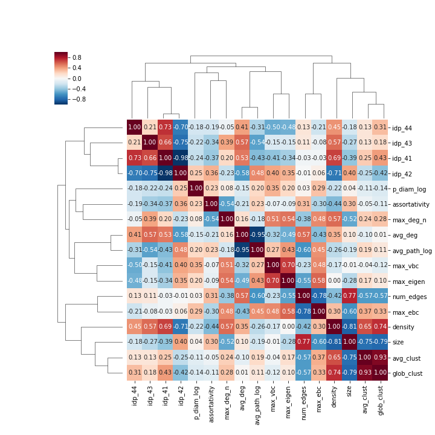
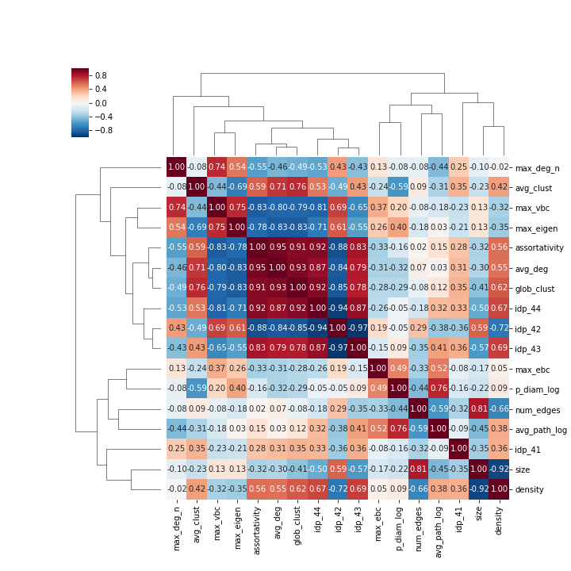
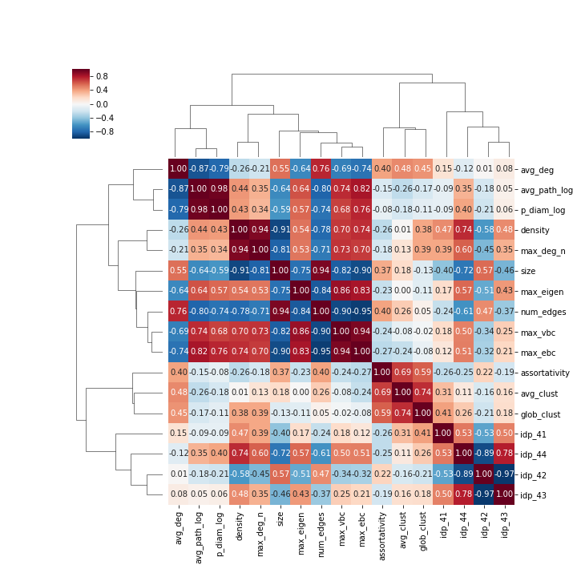
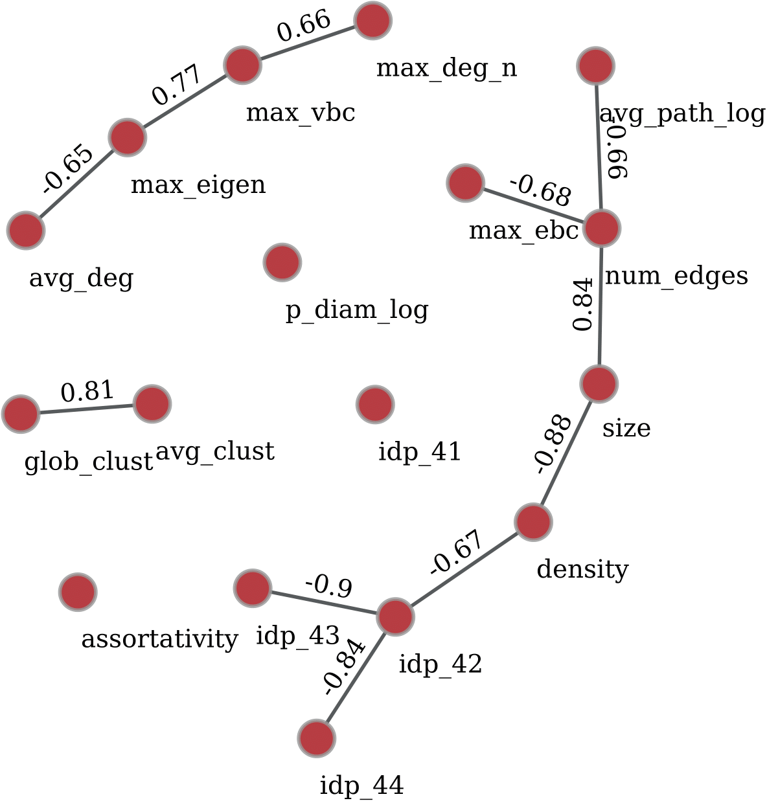

# Spearman's rank correlations of the metrics

We have normalized the average path length, maximum degree and pseudo diameter metrics before calculating the correlations as follows: 
* ```avg_path_log = avg_path_length / log(size)```
* ```max_deg_n = max_deg / (size - 1)```
* ```p_diam_log = pseudo_diam / log(size)```

### Corrleation heatmap of the friendship networks:


### Correration heatmap of the communication networks:


### Correlation heatmap of the collaboration networks:


The metris are hierarchically-clustered using the following distance metric: <br>
<a href="https://www.codecogs.com/eqnedit.php?latex=d(p,q)&space;=&space;\sum_{i=1}^{k}&space;\left&space;|&space;\left&space;|&space;p_i&space;\right&space;|&space;-&space;\left&space;|&space;q_i&space;\right&space;|&space;\right&space;|" target="_blank"></a>

### The domain-averaged absolute Spearman's rank correlation network of the metrics


The universal correlations can be easily seen on the domain-averaged absolute correlation network. However, there are a few domain specific correlations. For example we can observe that size, density and clustering related metrics have strong correlations for friendship networks. For communication networks, there is a large set of highly correlated metrics (indicated by the block diagonal structure of correlation matrix) including assortativty, clustering coefficients, interval degree probabilities, maximum of node centralities (degree, eigenvector and betwenness centrality) . The most correlated metrics for collaboration networks are the average degree, average path length, diameter and maximum betweennes centralities.

