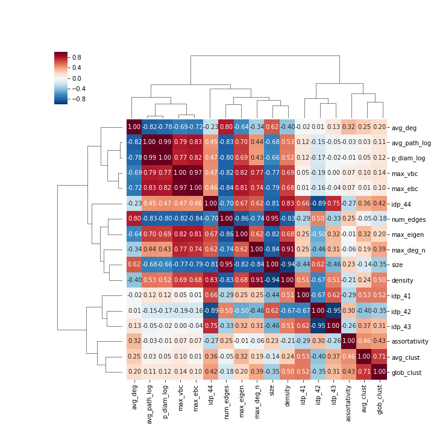

# Spearman's rank correlations of the metrics

We have normalized the average path length, maximum degree and pseudo diameter metrics before calculating the correlations as follows: 
* ```avg_path_log = avg_path_length / log(size)```
* ```max_deg_n = max_deg / (size - 1)```
* ```p_diam_log = pseudo_diam / log(size)```

Corrleation heatmap of the friendship networks:


Correration heatmap of the communication networks:


Correlation heatmap of the collaboration networks:


The metris are hierarchically-clustered using the following distance metric: <br>
<a href="https://www.codecogs.com/eqnedit.php?latex=d(p,q)&space;=&space;\sum_{i=1}^{k}&space;\left&space;|&space;\left&space;|&space;p_i&space;\right&space;|&space;-&space;\left&space;|&space;q_i&space;\right&space;|&space;\right&space;|" target="_blank"></a>
